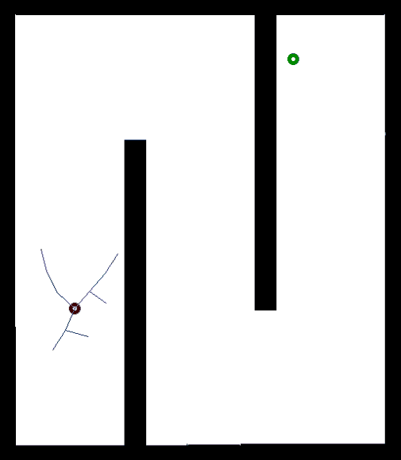

# RAS_OpenProject
Open project for RAS course

---

### The System
&emsp;&emsp;&emsp; Tello Drone,Jetbot and Their front camera

- 題目要求: [lab2.pdf](lab2/lab2.pdf)
- 題目解釋: [lab2-hint.pdf](lab2/lab2_hint.pdf)
- 完整程式碼: [lab2/program/](lab2/program/)
- 成果展示 (點擊截圖查看程式碼): 

| A* algorithm                                                                          | RRT algorithm                                                                 | RRT* algorithm                                                                          |
| ------------------------------------------------------------------------------------- | ----------------------------------------------------------------------------- | --------------------------------------------------------------------------------------- |
|  |  |  |

---
