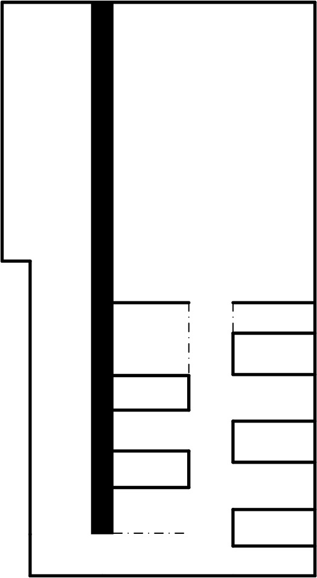
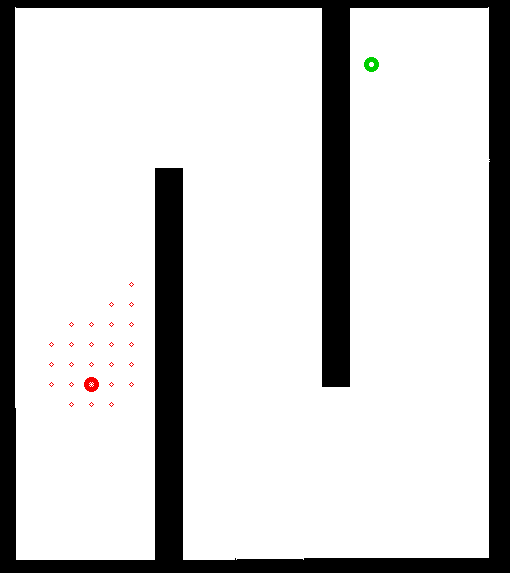
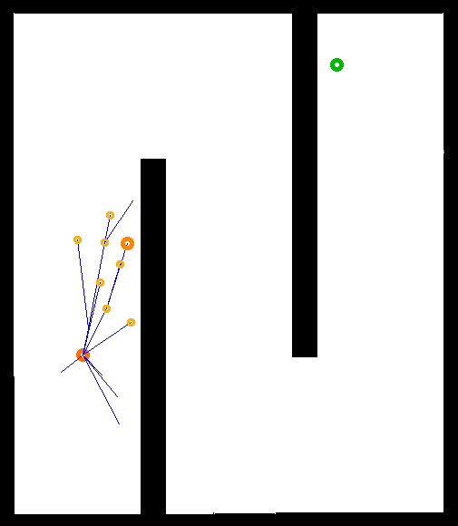
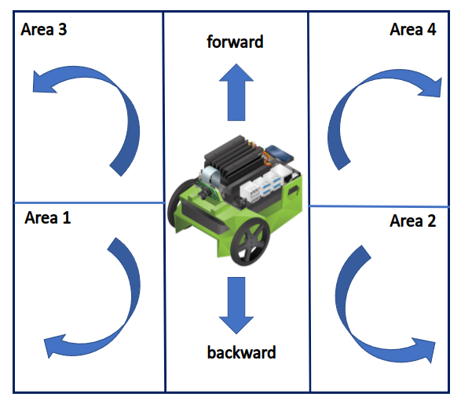

# RAS_OpenProject
Open project for RAS course
### View Demo Video
https://www.youtube.com/watch?v=UpqVkeZXErU
### Run code of PC part
``` shell
python3 test_open.py
```
### Run code of JetBot part
``` shell
python3 server_pc.py
```
 
---

## The System
&emsp;&emsp;&emsp; -Tello Drone,Jetbot and Their front camera <br />
&emsp;&emsp;&emsp; -Personal laptop to run the code through extra wireless card and ZeroTier <br />
&emsp;&emsp;&emsp; -Algorithm (A* Path Planning Algorithm) <br />
&emsp;&emsp;&emsp; -Communication (Python Socket Server and Client) <br />
&emsp;&emsp;&emsp; -DataFlow (shows as below) <br />


## Draw the map of ICT Classroom
&emsp;&emsp;&emsp; -We hand-animated a 2D map of an ICT classroom for use in an algorithm for path planning. <br />
<br />

## Choice of Path Planning Algorithms
&emsp;&emsp;&emsp; -At first we were interested in the following three path planning algorithms, which are A*, RRT and RRT* algorithms;<br />
Considering the problem of controlling the drone and the complexity of the path, we finally chose the A* algorithm; because the path given by the A* algorithm is more suitable for the drone.
| A* algorithm                                                                          | RRT algorithm                                                                 | RRT* algorithm                                                                          |
| ------------------------------------------------------------------------------------- | ----------------------------------------------------------------------------- | --------------------------------------------------------------------------------------- |
|  |  |  |

---
## Communication
&emsp;&emsp;&emsp;-At the beginning, the connection between the Socket Server and the Client between the PC and the Jetbot must be established. The Socket Server must always monitor the connection until the drone reaches the end point; (the drone will send a Flag_1 signal after it reaches the end point); Jetbot accepts After reaching the Flag signal, it will do a circle action. <br />
&emsp;&emsp;&emsp;-Then the drone arrives at the starting point through another path planning. After arriving, the Socket Client will send the Flag_2 signal; Jetbot will stop the circle action after receiving the Flag signal.


---
## unfinished content
&emsp;&emsp;&emsp;-Our original idea was to let Jetbot go back to the starting point with Tello, but since Jetbot's opencv-contrib-python could not be imported into our python file; so we finally chose something else; <br />
&emsp;&emsp;&emsp;-But we've done a simulation of jetbot's ARUCO code-based detection tracking. The Code is in : src/jetbot_sim.py
### Additional demo video
https://www.youtube.com/watch?v=G2ubyRQYk7c
### Explanation
&emsp;-We divided the image into six areas, namely area 1, area 2, area 3, area 4 and the straight forward area and the straight back area; <br />
&emsp;&emsp;&emsp;-If the center of the aruco yard is in area 1 then let the Jetbot go and turn right<br />
&emsp;&emsp;&emsp;-If the center of the aruco yard is in area 2 then let the Jetbot go forward and turn left<br />
&emsp;&emsp;&emsp;-If the center of the aruco yard is in area 3 then make the Jetbot back while turning left<br />
&emsp;&emsp;&emsp;-If the center of the aruco yard is in area 4 then let the Jetbot go forward and turn right<br />
&emsp;&emsp;&emsp;-If the center of the aruco yard is in the straight forward area, let the Jetbot go forward<br />
&emsp;&emsp;&emsp;-If the center of the aruco yard is in the straight back area, let the Jetbot go back<br />
<br />

## System additional
 &emsp;&emsp;&emsp;- Our original plan was to obtain images through Tello's monocular camera, use orb_slam2 to obtain point cloud information, and obtain the grid map of the teacher's environment;In the end, it was found that the perception of the environment by the monocular camera is very limited; so we gave up the original idea of using orb_slam2 (visual slam);  <br />
&emsp;&emsp;&emsp;-Finally change the content to the following:   <br />
First, draw a 2D map of the teacher manually, and then let the drone patrol through path planning; Paste an aruco code on the bottom of the tello or hang an aruco code with a rope on the tello, and use it in the jetbot to detect the aruco code; then control the Jetbot to follow the tello back to the starting point through our code (jetbot_sim.py).


